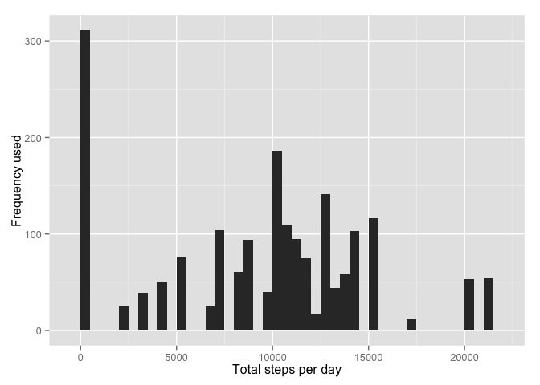
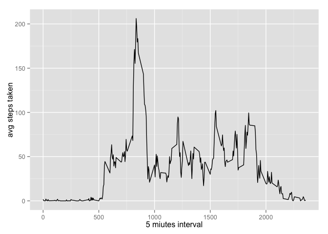
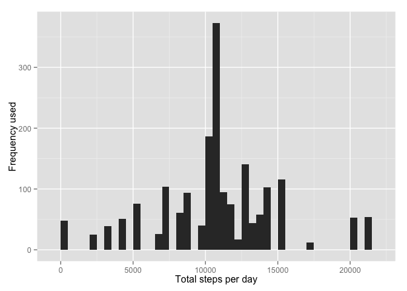
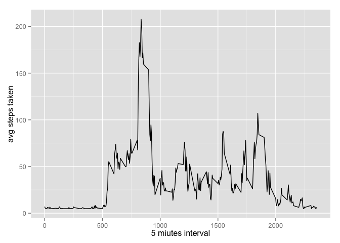
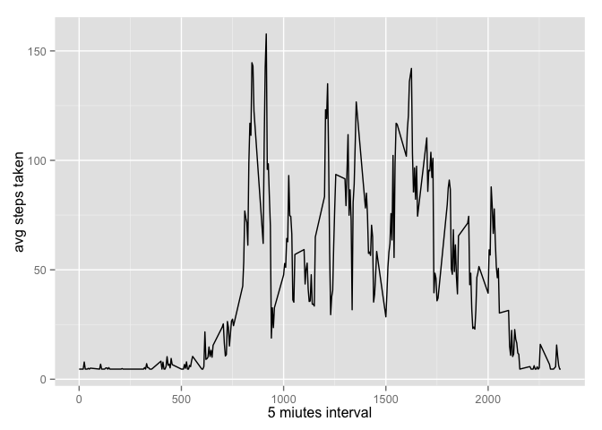

# Reproducible research peer assginment 1
## Packages needed for the assignment


```r
library(ggplot2)
library(timeDate)
```

## Loading and processing the data

```r
fileurl <- "https://d396qusza40orc.cloudfront.net/repdata%2Fdata%2Factivity.zip"
download.file(fileurl,destfile="factivity.zip",method="curl")
unzip("factivity.zip")

code <- read.csv("activity.csv")
head(code,10)
```

```
##    steps       date interval
## 1     NA 2012-10-01        0
## 2     NA 2012-10-01        5
## 3     NA 2012-10-01       10
## 4     NA 2012-10-01       15
## 5     NA 2012-10-01       20
## 6     NA 2012-10-01       25
## 7     NA 2012-10-01       30
## 8     NA 2012-10-01       35
## 9     NA 2012-10-01       40
## 10    NA 2012-10-01       45
```

## Histogram of the total number of steps taken each day

### Step 1: summarize number of step per day

```r
agg_steps <- aggregate(code$steps,by = list(day=code$date),FUN=sum, na.rm=TRUE)
```

### Step 2: plot a histogram

```r
qplot(x,data=agg_steps,weight=as.numeric(day), geom="histogram",binwidth=500,ylab = "Frequency used",xlab = "Total steps per day")
```



## Mean and median number of steps taken each day

```r
mean <- mean(agg_steps$x)
mean
```

```
## [1] 9354.23
```

```r
median <- median(agg_steps$x)
median
```

```
## [1] 10395
```

## Time series plot of the average steps taken per 5 minutes interval


```r
avg_per_interval <- aggregate(x=code$steps,by=list(code$interval),FUN = mean, na.rm=TRUE)
avg_steps <- ggplot(data=avg_per_interval, aes(x=Group.1, y=x))+ geom_line() + ylab("avg steps taken") + xlab("5 miutes interval")
avg_steps
```



## Identify the 5 minutes interval than on average contains the maximum number of steps


```r
max_steps <- max(avg_per_interval$x)
max_steps
```

```
## [1] 206.1698
```

```r
max_interval <- subset(avg_per_interval, x==max_steps)
max_interval
```

```
##     Group.1        x
## 104     835 206.1698
```

## Code to describe and show the strategy to imput missing data


```r
number_of_na <- length(which(is.na(code$steps)))
code2 <- code
head(code2,10)
```

```
##    steps       date interval
## 1     NA 2012-10-01        0
## 2     NA 2012-10-01        5
## 3     NA 2012-10-01       10
## 4     NA 2012-10-01       15
## 5     NA 2012-10-01       20
## 6     NA 2012-10-01       25
## 7     NA 2012-10-01       30
## 8     NA 2012-10-01       35
## 9     NA 2012-10-01       40
## 10    NA 2012-10-01       45
```

```r
code2$steps[is.na(code2$steps)] <- round(mean(code2$steps, na.rm=TRUE))
head(code2,10)
```

```
##    steps       date interval
## 1     37 2012-10-01        0
## 2     37 2012-10-01        5
## 3     37 2012-10-01       10
## 4     37 2012-10-01       15
## 5     37 2012-10-01       20
## 6     37 2012-10-01       25
## 7     37 2012-10-01       30
## 8     37 2012-10-01       35
## 9     37 2012-10-01       40
## 10    37 2012-10-01       45
```

## Histogram of new dataframe

```r
agg_steps2 <- aggregate(code2$steps,by = list(day=code2$date),FUN=sum, na.rm=TRUE)
qplot(x,data=agg_steps2,weight=as.numeric(day), geom="histogram",binwidth=500,ylab = "Frequency used",xlab = "Total steps per day")
```


### Mean and median of new dataframe

```r
mean2 <- mean(agg_steps2$x)
mean2
```

```
## [1] 10751.74
```

```r
median2 <- median(agg_steps2$x)
median2
```

```
## [1] 10656
```


## Pannel plot comparing the average number of steps taken per 5 minutes interval across weekdays and weekends 

```r
code3 <- code2
code3["Weekdays"] <- NA
head(code3,10)
```

```
##    steps       date interval Weekdays
## 1     37 2012-10-01        0       NA
## 2     37 2012-10-01        5       NA
## 3     37 2012-10-01       10       NA
## 4     37 2012-10-01       15       NA
## 5     37 2012-10-01       20       NA
## 6     37 2012-10-01       25       NA
## 7     37 2012-10-01       30       NA
## 8     37 2012-10-01       35       NA
## 9     37 2012-10-01       40       NA
## 10    37 2012-10-01       45       NA
```

```r
code3$Weekdays <- isWeekday(code$date, wday=1:5)
head(code3,10)
```

```
##    steps       date interval Weekdays
## 1     37 2012-10-01        0     TRUE
## 2     37 2012-10-01        5     TRUE
## 3     37 2012-10-01       10     TRUE
## 4     37 2012-10-01       15     TRUE
## 5     37 2012-10-01       20     TRUE
## 6     37 2012-10-01       25     TRUE
## 7     37 2012-10-01       30     TRUE
## 8     37 2012-10-01       35     TRUE
## 9     37 2012-10-01       40     TRUE
## 10    37 2012-10-01       45     TRUE
```
### weekdays dataframe and graph

```r
weekday_dataframe <- subset(code3, code3$Weekdays==TRUE)
wd_df <- aggregate(x=weekday_dataframe$steps,by=list(weekday_dataframe$interval),FUN = mean, na.rm=TRUE)
wd_df_plot <- ggplot(data=wd_df, aes(x=Group.1, y=x))+ geom_line() + ylab("avg steps taken") + xlab("5 miutes interval")
wd_df_plot
```


### weekend dataframe and graph

```r
weekend_dataframe <- subset(code3,code3$Weekdays==FALSE)
we_df <- aggregate(x=weekend_dataframe$steps,by=list(weekend_dataframe$interval),FUN = mean, na.rm=TRUE)
we_df_plot <- ggplot(data=we_df, aes(x=Group.1, y=x))+ geom_line() + ylab("avg steps taken") + xlab("5 miutes interval")
we_df_plot
```



